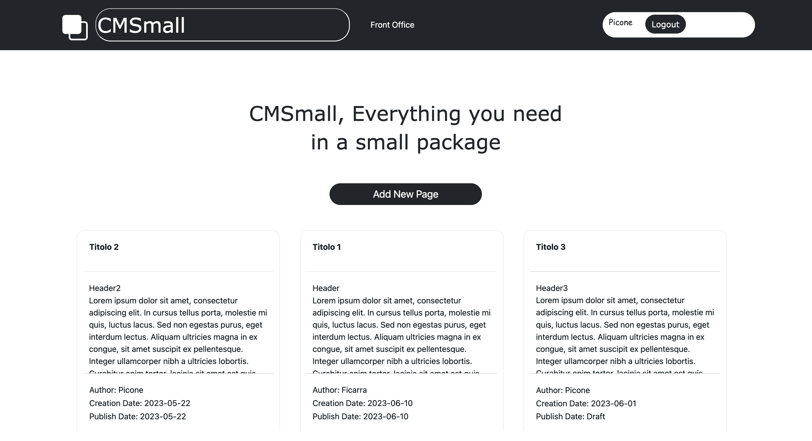
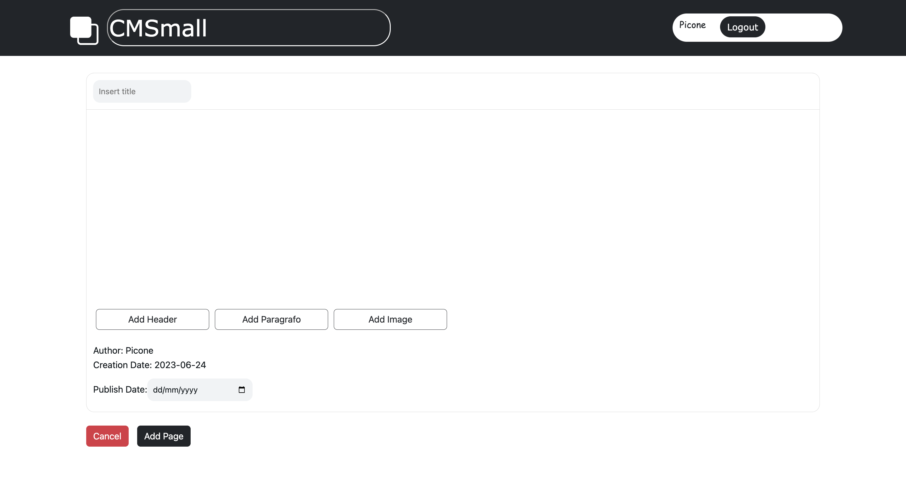

# **CMSmall**


## React Client Application Routes   

- Route `/`: main page where the user and the logged user can see the pages
- Route `/login`: login page with a form for autenticate the users
- Route `/add-page`: page with a form where the logged users can add a new page
- Route `/:param`: page with a preview of an existing page, the param is the id of the page
- Route `/pages/edit/:param`: page with a form where the logged users can update an existing page
- Route `/*`: route for manage  errors


## API Server   


### __List Pages__

URL: `/api/pages`

Method: GET

Description: Get all films.

- Request body: _None_

- Response: `200 OK` (success) or `500 Internal Server Error` (generic error).

- Response body: An array of the pages with the blocks and the name of the author.
```
[{
    "id": 1,
    "title": "Titolo1",
    "authorId": "1",
    "creationDate":"01/06/2023",
    "publishdate":"01/06/2023",
    "blocks":[],
    "name": "Salvatore"

},
...
]
```


### __Title__

URL: `/api/title`

Method: GET

Description: Get the title of the application.

- Request body: _None_

- Response: `200 OK` (success) or `500 Internal Server Error` (generic error).

- Response body: An object with the title of the application.
```
{
    "title": "CMSmall",
}

```


### __List Images__

URL: `/api/images`

Method: GET

Description: Get all the image path.

- Request body: _None_

- Response: `200 OK` (success) or `500 Internal Server Error` (generic error).

- Response body: An array  of path of the images in the public directory of the server

```
[{
   
    "imagePath": "./public/img1.jpeg"

},
...
]
```


### __Create a Page__

URL: `/api/page/<id>`

Method: POST

Description: Create a new page.

- Request body: An object, describing a page.
```
{
    "id": 1,
    "title": "Titolo1",
    "authorId": "1",
    "creationDate":"01/06/2023",
    "publishdate":"01/06/2023",
    "blocks":[],

}

```

- Response: `200 ` (success) or `503 Service Unavailable` (generic error).

- Response body: the last id of the last element inserted 


### __Delete a Page__

URL: `/api/pages/<id>`

Method: DELETE

Description: Delete an existing page, identified by its id.

- Request body: _None_

- Response: `204 No Content` (success) or `503 Service Unavailable` (generic error).

- Response body: the number of changed row


### __Edit a Page By User__

URL: `/api/page/<id>`

Method: PUT

Description: Edit a page, identified by id.

- Request parameters: the id of the page to update

- Request body: An object, describing the new value of the page.
```
{
    "id": 2,
    "title": "Titolo1",
    "authorId": "1",
    "creationDate":"01/06/2023",
    "publishdate":"01/06/2023",
    "blocks":[],

}
```

Response: `200 ` (success) or `503 Service Unavailable` (generic error).

Response body: the number of changed row


### __Edit a Page By Admin__

URL: `/api/admin/page/<id>`

Method: PUT

Description: Edit a page, identified by id, by admin.

- Request parameters: the id of the page to update

- Request body: An object, describing the new value of the page.
```
{
    "id": 2,
    "title": "Titolo1",
    "authorId": "1",
    "creationDate":"01/06/2023",
    "publishdate":"01/06/2023",
    "blocks":[],

}
```

Response: `200 ` (success) or `503 Service Unavailable` (generic error).

Response body: the number of changed row


### __Edit Title__

URL: `/api/edit-title`

Method: PUT

Description: Edit the title of the application by admin.


- Request body:the new title
```
{
    
    "title": "New Title",

}
```

Response: `200 ` (success) or `503 Service Unavailable` (generic error).

Response body: the new title


### __List Users__

URL: `/api/users`

Method: GET

Description: Get all users.

- Request body:  the logged user

- Response: `200 OK` (success) or `500 Internal Server Error` (generic error).

- Response body: An array with all the users

```
[{
   
    "id": "1",
    "name": "Salvatore",
    "email": "salvatore@test.com",
    "admin": "true",

},
...
]
```


- POST `/api/sessions`
  - request body content: username and password of the user
  - response body content: the attributes of the user (id,email,name,admin)

- DELETE `/api/session/current`
  - request body content: the user
  - response body content: the response for the ending logout


- GET `/api/session/current`
  - request body content: the logged user
  - response body content: the logged user


## Database Tables

- Table `users` - contains  ( id, email, name, salt, password, admin )
- Table `pages` - contains  ( id, title, authorId, creationDate, publishDate )
- Table `blocks` - contains ( id, pageId, type, orderIndex, content, imagePath )
- Table `title` - contains  ( title )
- Table `images` - contains ( imagePath )


## Main React Components    

- `MyCard` (in `MyCard.jsx`): card that contains the informations about a page and its blocks 
                              there are two buttons for edit and delete the page, on click on 
                              the card the user can see the preview of the page.

                              
- `MyNavbar` (in `MyNavbar.jsx`): navbar that contains the title of the application, the buttons
                                  login, logout (if the user is logged) ,change title (if the user
                                  is admin), back-office and front-office (if the user is logged)
                                  and the name of the logged users

- `MyImageModal` (in `MyImageModal.jsx`): modal that contains the images of the application, the 
                                          logged user can see all the images when he update a page
                                          or add a new page with the button 'add image' and after
                                          he can select an image 

- `ErrorModal` (in `ErrorModal.jsx`): modal  with the error message for the users


## Screenshot






## Users Credentials  

- 'ficarra@test.com', pwd (admin = true)
- 'picone@test.com', pwd 
- 'sandra@test.com', pwd
- 'raimondo@test.com', pwd 
